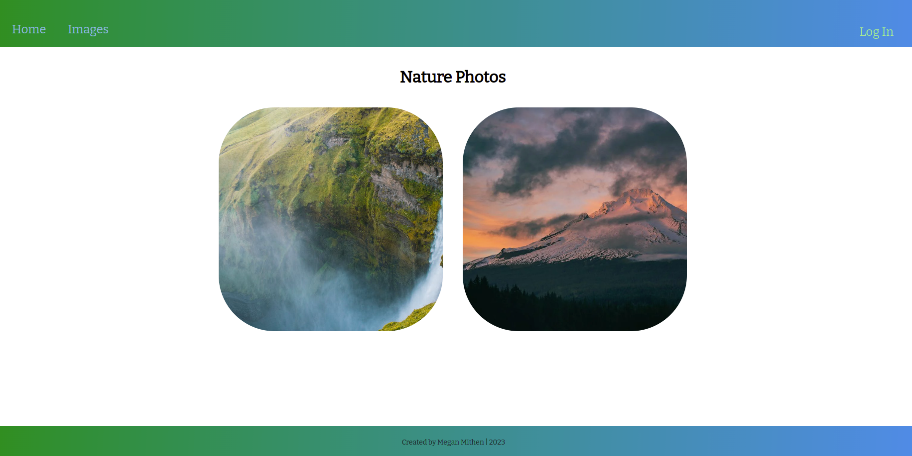
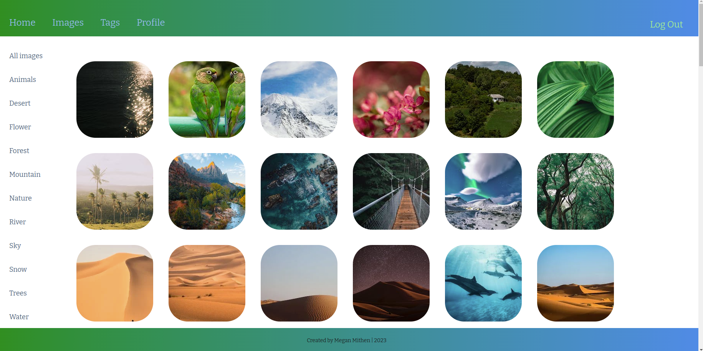
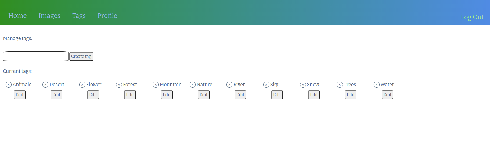
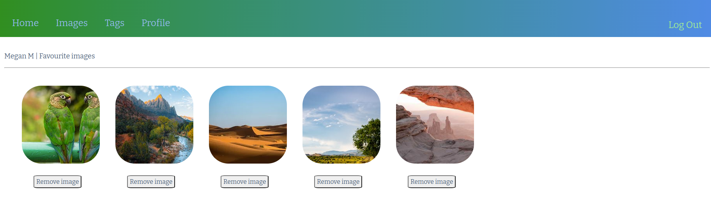

# Nature Photos

## Overview

Nature photos is a user-interactive website dedicated to images of the natural world.  Once logged in, users have the ability to create, update and delete tags which can be added to, and removed from, the images in the database.

Users can also favourite images which are saved to the user's profile page.

The site is live on Heroku and can be visited [here](https://nature-photos-394e18c571b1.herokuapp.com/).

## Screenshots
### Homepage

### Images Page

### Tags Page

### Favourites Page

## Tehcnologies Used
* JavaScript
* CSS/HTML
* CRUD functionality
* MVC methodology
* Express.js
* MongoDB
* Atlas
* Pexel API
* Heroku

## Next steps

* Adding functionality so the user can upload their own images.
